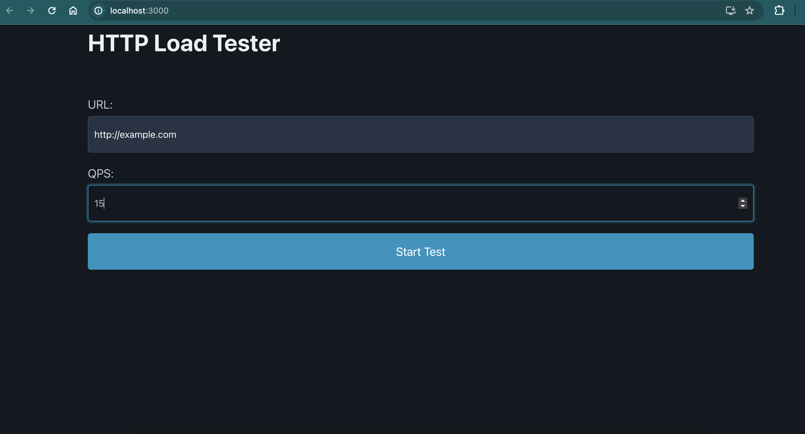
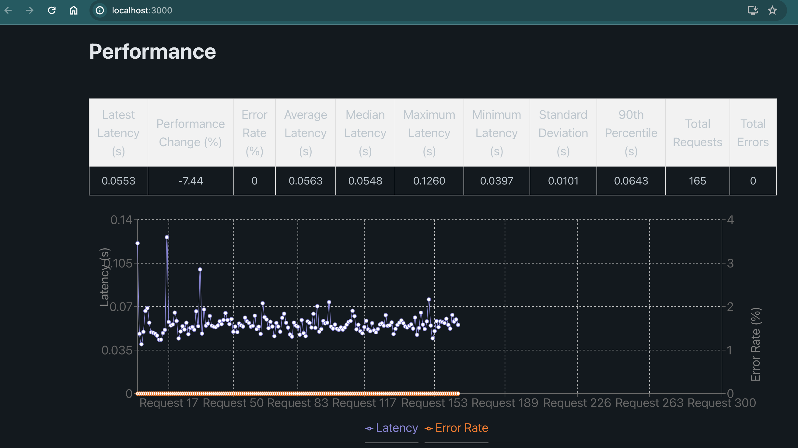

# HTTP Load Tester

This project is a general-purpose HTTP load-testing and benchmarking tool. It includes a frontend interface for visualizing load test results and a backend API for conducting the load tests.

> ✔️: **Demo video available**: A demo video and installation guide is available to help you set up and use. Watch it here: [Demo and Video Guide](https://youtu.be/Oeo9TmnhqRU)


## Features

- Reports latencies and error rates
- Supports a `--qps` flag to generate requests at a given fixed QPS (queries per second)
- Real-time graphical representation of latencies and error rates
- Dockerized for easy deployment

## Requirements

- Docker
- Docker Compose

## Installation and Usage

### Clone the Repository

```sh
git clone https://github.com/lasopablo/HTTP-load-testing.git
cd http_load_tester
```

### Running with Docker (recommended)

> :warning: **Installation Guide Available**: A video installation guide is available to help you set up. Watch it here: [Installation Video Guide](https://youtu.be/Oeo9TmnhqRU)

1. **Pull the Docker images:**
   
   ```sh
   docker pull pablaso/http_load_tester_frontend:frontend_ready
   docker pull pablaso/http_load_tester_backend:frontend_ready
   ```

2. **Create a docker-compose.yml file in the project root directory with the following content:**
   ```yaml
   version: '3.8'
   
   services:
     backend:
       image: pablaso/http_load_tester_backend:frontend_ready
       ports:
         - "8000:8000"
   
     frontend:
       image: pablaso/http_load_tester_frontend:frontend_ready
       ports:
         - "3000:80"

   ```

3. **Run Docker Compose to start the services:**
   ```sh
   docker-compose up
   ```

4. **Access the frontend interface:**

   Open your browser and navigate to `http://localhost:3000`.


#### Example Usage

Here are some examples of how the application looks and works. Note that "dark mode" was on.

1. Initial Interface:


2. After Running a Test:


### Running Locally

If you prefer to run the project locally without Docker, follow these steps:

1. **Backend Setup:**

   - Navigate to the `backend` directory:

     ```sh
     cd backend
     ```

   - Create a virtual environment and activate it:

     ```sh
     python -m venv venv
     source venv/bin/activate
     ```

   - Install the required packages:

     ```sh
     pip install fastapi uvicorn requests
     ```

   - Run the backend server:

     ```sh
     uvicorn main:app --host 0.0.0.0 --port 8000
     ```

2. **Frontend Setup:**

   - Navigate to the `frontend` directory:

     ```sh
     cd frontend
     ```

   - Install the required packages:

     ```sh
     npm install
     ```

   - Start the frontend server:

     ```sh
     npm start
     ```

   - Open your browser and navigate to `http://localhost:3000`.


